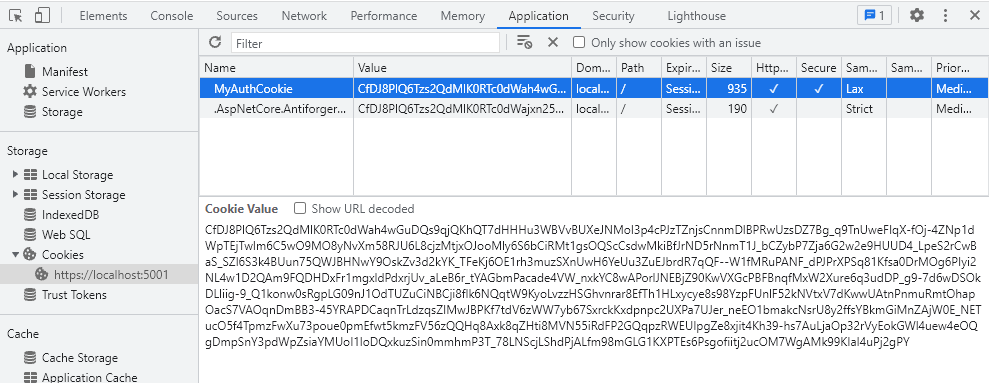
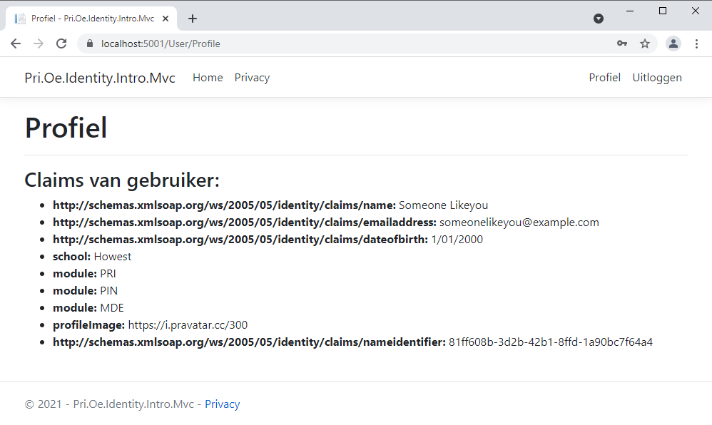
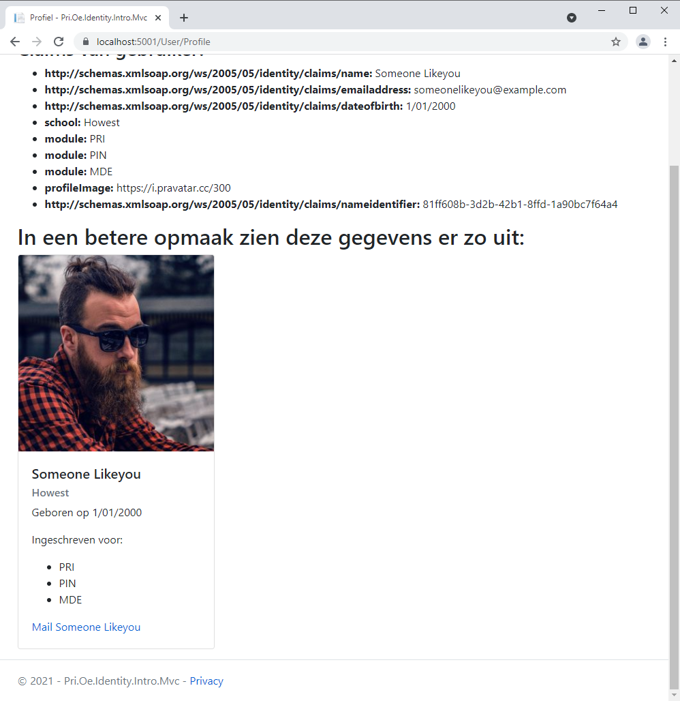

# Identity intro
In deze oefening gaan we even door de **Authentication en Authorisation flow** met behulp van een MVC website.

## Flow
1. Gebruiker logt in bij website met zijn/haar gegevens
2. De gegevens worden gecontroleerd
3. Alle relevante gegevens v.d. gebruiker ~~worden uit database gehaald~~ voor deze intro even hard gecodeerd. In volgende oefeningen verbinden we onze applicatie met een database.
4. Er wordt een Security Context opgemaakt voor de gebruiker (in deze oefening een cookie)
5. Gebruiker bezoekt een pagina en stuurt (encrypted) cookie mee
6. Webserver controleert authenticatie en daarna authorisatie
7. Gebruiker krijgt de pagina wel of niet te zien

## UserController
- Voeg een nieuwe (Empty MVC) controller toe met de naam **UserController**
- Voorzie een `private readonly IUserService` field met de naam `_userService`
- Voorzie de nodige using statements
- Voorzie een constructor die `IUserService userService` injecteert

```csharp
using Microsoft.AspNetCore.Mvc;
using Pri.Oe.Identity.Intro.Mvc.Services.Users;

namespace Pri.Oe.Identity.Intro.Mvc.Controllers
{
    public class UserController : Controller
    {
        private readonly IUserService _userService;

        public UserController(IUserService userService)
        {
            _userService = userService;
        }

        public IActionResult Index()
        {
            return View();
        }
    }
}
```

## LoginModel
- Maak in de folder Models een nieuwe folder aan met de naam **User** en voeg een nieuw ViewModel toe met de naam **LoginViewModel**.
- Voorzie twee properties om de username en paswoord bij te houden van de gebruiker die wenst in te loggen
- Voorzie de nodige using statements

```csharp
using System.ComponentModel.DataAnnotations;

namespace Pri.Oe.Identity.Intro.Mvc.Models.User
{
    public class LoginViewModel
    {
        [Display(Name = "Gebruikersnaam")]
        [Required(ErrorMessage = "{0} is verplicht!")]
        public string UserName { get; set; }

        [Display(Name = "Wachtwoord")]
        [Required(ErrorMessage = "{0} is verplicht!")]
        [DataType(DataType.Password)]
        public string Password { get; set; }
    }
}
```

## Login 
### Controller HTTP GET methode
- Wijzig in de **UserController** de naam van de `Index` methode naar `Login`
- Voorzie deze methode met het `[HttpGet]` attribuut
- Maak een nieuwe instantie aan van `LoginViewModel`
- Geef dit mee met de View

```csharp
[HttpGet]
public IActionResult Login()
{
    var model = new LoginViewModel();
    return View(model);
}
```

### View
- Voeg in de folder **Views** een nieuwe folder toe met de naam **User** en voeg een nieuwe lege **Razor View** *(Geen Razor Pages)* toe en geef dit de naam **Login**.
- Voeg volgende code toe
```csharp
@model Pri.Oe.Identity.Intro.Mvc.Models.User.LoginViewModel

@{
    ViewData["Title"] = "Login";
}

<h1>Login</h1>

<hr />
<div class="row">
    <div class="col-md-4">
        <form asp-action="Login" method="post">
            <div asp-validation-summary="ModelOnly" class="text-danger"></div>
            <div class="form-group">
                <label asp-for="UserName" class="control-label"></label>
                <input asp-for="UserName" class="form-control" />
                <span asp-validation-for="UserName" class="text-danger"></span>
            </div>
            <div class="form-group">
                <label asp-for="Password" class="control-label"></label>
                <input asp-for="Password" class="form-control" />
                <span asp-validation-for="Password" class="text-danger"></span>
            </div>
            <div class="form-group">
                <input type="submit" value="Inloggen" class="btn btn-primary" />
            </div>
        </form>
    </div>
</div>

@section Scripts {
    @{await Html.RenderPartialAsync("_ValidationScriptsPartial");}
}
```

Dit bevat een inlog formulier de gebruikt maakt van LoginViewModel.

### Controller HTTP POST methode
- Voorzie een nieuwe methode met de naam `Login` die het `LoginViewModel` als parameter ontvangt.
- Voorzie deze methode met het `[HttpPost]` attribuut
- Controleer of alle properties correct zijn ingevuld door de gebruiker
- Gebruik de `LoginAsync` methode van de `IUserService` instantie
- Stuur de gebruiker door naar de **Index** methode van de **HomeController**

```csharp
[HttpPost]
public async Task<IActionResult> Login(LoginViewModel model)
{
    if (!ModelState.IsValid)
    {
        return View(model);
    }

    await _userService.LoginAsync(model.UserName, model.Password);

    return RedirectToAction("Index", "Home");
}
```

### Navigatie aanpassen
- Pas `_Layout` aan met een extra navigatie item
```csharp
<div>
	<ul class="navbar-nav flex-grow-1">
		<li class="nav-item">
			<a class="nav-link text-dark" asp-area="" asp-controller="User" asp-action="Login">Inloggen</a>
		</li>
	</ul>
</div>
```

## UserService implementatie
- Maak in de folder **Services/Users/** een nieuwe klasse aan met de naam `UserService`
- Implementeer de `IUserService` interface
```csharp
using System;
using System.Threading.Tasks;

namespace Pri.Oe.Identity.Intro.Mvc.Services.Users
{
    public class UserService : IUserService
    {
        public Task LoginAsync(string userName, string password)
        {
            throw new NotImplementedException();
        }

        public Task LogoutAsync()
        {
            throw new NotImplementedException();
        }
    }
}
```

- Registreer deze implementatie voor Dependency Injection in de Startup class

```csharp
public void ConfigureServices(IServiceCollection services)
{
    services.AddControllersWithViews();

    services.AddScoped<IUserService, UserService>();
}
``` 

## Inloggegevens controleren
- Controleer in de `LoginAsync` methode van de `UserService` de `userName` en de `password` parameter. Aangezien we (nog) geen database koppelen en deze applicatie gaan we de gegevens van één gebruiker hardcoderen in deze methode.

```csharp
public Task LoginAsync(string userName, string password)
{
	// Verify hardcoded credentials
	if (userName == "someone" && password == "password")
	{

	}
}
```

## Claims gebruiker aanmaken
- De volgende stap is om de security context op te maken. Als eerste stap zullen we (hard gecodeerde) claims van de gebruiker aanmaken. Hou in gedachten dat al deze informatie ook uit een database opgevraagd kan worden. In deze oefening worden ze hard gecodeerd.

- Claims bevatten gegevens van de gebruiker. Elke nieuwe `Claim` is een key/value. In de constructor van `Claim` geven we eerst de key mee. Daarna de value van de key. In deze oefening houden we volgende gegevens/claims bij
	- Naam
	- E-mail
	- Geboortedatum
	- School
	- Welke modules deze gebruiker volgt
	- Link naar profielfoto van de gebruiker (een random afbeelding)
	- ID van de gebruiker (in deze oefening door ons aangemaakt met `Guid.NewGuid().ToString()`)

- Voeg zelf nog een drietal claims toe

```csharp
// Verify hardcoded credentials
if (userName == "someone" && password == "password")
{
    // Creating security context
    // Creating the claims
    var claims = new List<Claim>();
    claims.Add(new Claim(ClaimTypes.Name, "Someone Likeyou"));
    claims.Add(new Claim(ClaimTypes.Email, "someonelikeyou@example.com"));
    claims.Add(new Claim(ClaimTypes.DateOfBirth, new DateTime(2000, 01, 01).ToShortDateString()));
    claims.Add(new Claim("school", "Howest"));
    claims.Add(new Claim("module", "PRI"));
    claims.Add(new Claim("module", "PIN"));
    claims.Add(new Claim("module", "MDE"));
    claims.Add(new Claim("profileImage", "https://i.pravatar.cc/300"));
    claims.Add(new Claim(ClaimTypes.NameIdentifier, Guid.NewGuid().ToString()));
}
```

## ClaimsIdentity aanmaken
- Maak nu als volgende stap een nieuwe instantie aan van `ClaimsIdentity` en geef in de constructor de net aangemaakte claims mee. Als tweede parameter geef je de naam van het authenticationType mee. In deze oefening geven we de naam `MyCookieAuth` mee.

```csharp
public Task LoginAsync(string userName, string password)
{
    // Verify hardcoded credentials
    if (userName == "someone" && password == "password")
    {
        // Creating security context
        // Creating the claims
        var claims = new List<Claim>();
        claims.Add(new Claim(ClaimTypes.Name, "Someone Likeyou"));
        claims.Add(new Claim(ClaimTypes.Email, "someonelikeyou@example.com"));
        claims.Add(new Claim(ClaimTypes.DateOfBirth, new DateTime(2000, 01, 01).ToShortDateString()));
        claims.Add(new Claim("school", "Howest"));
        claims.Add(new Claim("module", "PRI"));
        claims.Add(new Claim("module", "PIN"));
        claims.Add(new Claim("module", "MDE"));
        claims.Add(new Claim("profileImage", "https://i.pravatar.cc/300"));
        claims.Add(new Claim(ClaimTypes.NameIdentifier, Guid.NewGuid().ToString()));


        // Creating the ClaimsIdentity
        var identity = new ClaimsIdentity(claims, "MyCookieAuth");
    }
}
```

## ClaimsPrincipal aanmaken
- Maak een nieuwe instantie van `ClaimsPrincipal` en geef `identity` mee als parameter

```csharp
public Task LoginAsync(string userName, string password)
{
    // Verify hardcoded credentials
    if (userName == "someone" && password == "password")
    {
        // Creating security context
        // Creating the claims
        var claims = new List<Claim>();
        claims.Add(new Claim(ClaimTypes.Name, "Someone Likeyou"));
        claims.Add(new Claim(ClaimTypes.Email, "someonelikeyou@example.com"));
        claims.Add(new Claim(ClaimTypes.DateOfBirth, new DateTime(2000, 01, 01).ToShortDateString()));
        claims.Add(new Claim("school", "Howest"));
        claims.Add(new Claim("module", "PRI"));
        claims.Add(new Claim("module", "PIN"));
        claims.Add(new Claim("module", "MDE"));
        claims.Add(new Claim("profileImage", "https://i.pravatar.cc/300"));
        claims.Add(new Claim(ClaimTypes.NameIdentifier, Guid.NewGuid().ToString()));


        // Creating the ClaimsIdentity
        var identity = new ClaimsIdentity(claims, "MyCookieAuth");

        // Creating the ClaimsPrincipal
        ClaimsPrincipal claimsPrincipal = new ClaimsPrincipal(identity);
    }
}
```

## Inloggen in HttpContext
- Injecteer `IHttpContextAccessor httpContextAccessor` in de constructor van de `UserService`
- Registreer de DI in de Startup klasse door `services.AddHttpContextAccessor()` toe te voegen
- Maak de `LoginAsync` methode `async`
- Roep de `SignInAsync` methode op van de `HttpContext` property van de `_httpContextAccessor` en geef de naam van het authenticatie scheme mee. Voor deze oefening is dit `MyCookieAuth`. Als tweede parameter geef de de instantie van `ClaimsPrincipal` mee.

Deze methode zorgt ervoor dat de (hard gecodeerde) gebruiker is ingelogd in de HttpContext van de webserver.

## Configuratie Startup
- Voeg volgende configuratie toe aan de `ConfigureServices` van de `Startup` class

```csharp
services.AddAuthentication("MyCookieAuth").AddCookie("MyCookieAuth", options =>
{
    options.Cookie.Name = "MyAuthCookie";
    options.LoginPath = "/User/login";
});
```

- Voeg volgende configuratie toe aan de `Configure` van de `Startup` class na `app.UseRouting()`

```csharp
app.UseAuthentication();
app.UseAuthorization();
```

 De gegevens van de ingelogde gebruiker worden hierdoor toegevoegd aan een encrypted cookie. Door deze gegevens op te slaan in een cookie en deze te laten uitlezen door onze webserver moeten we niet telkens de gegevens van de gebruiker opvragen uit de database.

 ## Inloggen uittesten
 - Start de webserver op en log in met `someone` als username en `password` als paswoord.
 - Open de DEV tools van je browser (F12) 
 - Ga naar de Application tab
 - Bekijk de Cookies van je webbrowser
 - Er zou een cookie aanwezig moeten zijn met de naam `MyAuthCookie`

 

 ## Uitloggen
 - Pas de navigatie in `_Layout` aan
 ```csharp
 <nav class="navbar navbar-expand-sm navbar-toggleable-sm navbar-light bg-white border-bottom box-shadow mb-3">
    <div class="container">
        <a class="navbar-brand" asp-area="" asp-controller="Home" asp-action="Index">Pri.Oe.Identity.Intro.Mvc</a>
        <button class="navbar-toggler" type="button" data-toggle="collapse" data-target=".navbar-collapse" aria-controls="navbarSupportedContent"
                aria-expanded="false" aria-label="Toggle navigation">
            <span class="navbar-toggler-icon"></span>
        </button>
        <div class="navbar-collapse collapse d-sm-inline-flex justify-content-between">
            <ul class="navbar-nav flex-grow-1">
                <li class="nav-item">
                    <a class="nav-link text-dark" asp-area="" asp-controller="Home" asp-action="Index">Home</a>
                </li>
                <li class="nav-item">
                    <a class="nav-link text-dark" asp-area="" asp-controller="Home" asp-action="Privacy">Privacy</a>
                </li>
            </ul>
        </div>

        <div>
            <ul class="navbar-nav flex-grow-1">
                @if (User.Identity.IsAuthenticated)
                {
                    <li class="nav-item">
                        <a class="nav-link text-dark" asp-area="" asp-controller="User" asp-action="Profile">Profiel</a>
                    </li>
                    <li class="nav-item">
                        <a class="nav-link text-dark" asp-area="" asp-controller="User" asp-action="Logout">Uitloggen</a>
                    </li>
                }
                else
                {
                    <li class="nav-item">
                        <a class="nav-link text-dark" asp-area="" asp-controller="User" asp-action="Login">Inloggen</a>
                    </li>
                }

            </ul>
        </div>
    </div>
</nav>
 ```

 Hierdoor zal een ingelogde gebruiker de link **Inloggen** niet meer zien maar zal hij hierdoor twee andere links zien, namelijk **Profiel** en **Uitloggen**. Straks werken we beiden uit.

 - Voeg de `Logout` methode toe aan de `UserController`
 ```csharp
[HttpGet]
public async Task<IActionResult> Logout()
{
	await _userService.LogoutAsync();
	return RedirectToAction("Index", "Home");
}
 ```

 - Implementeer de `LogoutAsync` methode in de `UserService` en maak deze `async`
 ```csharp
 public async Task LogoutAsync()
{
    await _httpContextAccessor.HttpContext.SignOutAsync();
}
 ```

 Om een gebruiker uit te loggen maken we gebruik van de `SignOutAsync` methode die beschikbaar is in de `HttpContext`.

 
 ## Uitloggen uittesten
 - Start de webserver op en log in met `someone` als username en `password` als paswoord.
 - Open de DEV tools van je browser (F12) 
 - Ga naar de Application tab
 - Bekijk de Cookies van je webbrowser
 - Er zou een cookie aanwezig moeten zijn met de naam `MyAuthCookie`
 - Klik nu op uitloggen
 - De cookie is nu verwijderd

 ## Claims van de gebruiker uitlezen 
 - Maak in de `UserController` een nieuwe methode aan
 - Voeg het `[Authorize]` attribuut toe zodat enkel ingelogde gebruikers deze pagina kunnen raadplegen

 ```csharp
 [HttpGet]
[Authorize]
public IActionResult Profile()
{
    return View();
}
 ```

 - Maak in de User folder een nieuwe View aan met de naam `Profile`
 - Voorzie volgende code

 ```csharp
 @{
    ViewData["Title"] = "Profiel";

    var user = User.Identities.First();
}

<h1>Profiel</h1>

<hr />
<div class="row">
    <div class="col-md-12">
        <h3>Claims van gebruiker:</h3>
        <ul>
            @foreach (var claim in user.Claims.ToList())
            {
                <li><strong>@claim.Type:</strong> @claim.Value</li>
            }
        </ul>
    </div>
</div>
 ```

Aangezien een `ClaimsPrincipal` meerdere identities kan hebben, maar wij slecht één `ClaimsIdentity` hebben voorzien voor onze gebruiker vragen we de eerste identity op
`var user = User.Identities.First();`

Daarna doen we een foreach lus over alle `Claims` van de user en lezen we het type (key) en de value (value) uit.



- De gegevens van de claims staan nu onder elkaar in een lijst, maar uiteraard is het de bedoeling dat deze gegevens uitgelezen worden en van een mooie opmaak worden voorzien.
- Pas volgende code toe in de `Profile` View
```csharp
@{
    ViewData["Title"] = "Profiel";

    var user = User.Identities.First();
}

<h1>Profiel</h1>

<hr />
<div class="row">
    <div class="col-md-12">
        <h3>Claims van gebruiker:</h3>
        <ul>
            @foreach (var claim in user.Claims.ToList())
            {
                <li><strong>@claim.Type:</strong> @claim.Value</li>
            }
        </ul>
    </div>

    <div class="col-md-12">
        <h2>In een betere opmaak zien deze gegevens er zo uit:</h2>
    </div>

    <div class="col-md-4">
        <div class="card">
            c.Type.Equals("profileImage")).Value" class="card-img-top">
            <div class="card-body">
                <h5 class="card-title">@user.Name</h5>
                <h6 class="card-subtitle mb-2 text-muted">@user.Claims.FirstOrDefault(c => c.Type.Equals("school")).Value</h6>
                <div class="card-text">
                    <p>
                        Geboren op @user.Claims.FirstOrDefault(c => c.Type.Equals("http://schemas.xmlsoap.org/ws/2005/05/identity/claims/dateofbirth")).Value
                    </p>
                    <p>Ingeschreven voor:</p>
                    <ul>
                        @foreach (var moduleClaim in user.Claims.Where(c => c.Type.Equals("module")).ToList())
                        {
                            <li>@moduleClaim.Value</li>
                        }
                    </ul>
                </div>
                <a href="mailto:@user.Claims.FirstOrDefault(c=>c.Type.Equals("http://schemas.xmlsoap.org/ws/2005/05/identity/claims/emailaddress")).Value" class="card-link">Mail @user.Name</a>
            </div>
        </div>
    </div>
</div>
```

Run even de applicatie, log in en ga naar de Profile pagina. Je zou nu onderstaande opmaak moeten zien

